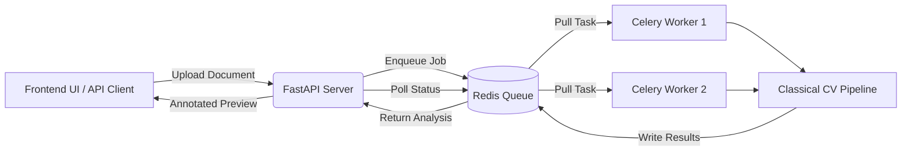
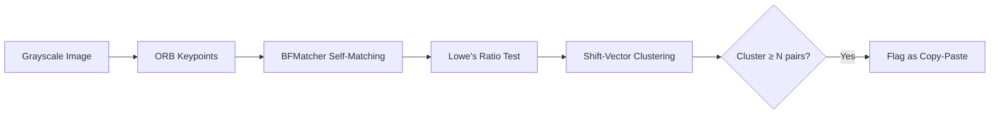

# 🔍 NHA PS3 - Document Forgery & Deepfake Detection
**Nikhileswara Rao Sulake<sup>1</sup>, Sai Manikanta Eswar Machara<sup>1</sup>, Sivalal Kethavath<sup>1</sup>**

<sup>1</sup> Rajiv Gandhi University of Knowledge Technologies, Nuzvid, Andhra Pradesh

---

### Internal Validation Score: **0.5315** &nbsp;·&nbsp; Leaderboard Position: **Top 3**

---

This pipeline is a **completely classical computer vision–based solution** architected for the high-throughput, low-latency, and stringent privacy demands of the AB-PMJAY ecosystem. By rejecting black-box neural networks in favor of robust, pre-defined mathematical libraries, our solution detects document forgery across all 9 tampering categories with **100% explainability**.

## 🌟 Why Classical CV over Deep Learning?

Government health insurance claims must be processed at immense scale across thousands of hospitals, often on infrastructure lacking expensive GPUs. When a document is flagged as forged, the system must provide mathematically sound evidence—not just a black-box confidence score.

| Capability | Deep Learning Approaches (ViT, ManTra-Net) | **Our Classical CV Pipeline** |
|---|---|---|
| **Scalability** | GPU-bound, memory-heavy | ✅ Runs blazingly fast on any standard CPU |
| **Explainability** | Black-box "model says so" | ✅ Every flag traces back to a clear mathematical equation |
| **Deployment** | Requires massive ONNX/TensorRT hosting | ✅ Zero model weights; instantly deployable |
| **Latency** | Seconds per image (even on GPU) | ✅ ~1–3s per page on CPU |
| **AB-PMJAY Fit** | Over-engineered for simple scans | ✅ Purpose-built for noisy Indian medical documents |

> *If you can mathematically prove why a region is tampered, you don't need a neural network to guess it for you.*

---

## 🏗️ Production Architecture

To support **500+ concurrent requests**, the Forgensic system is decoupled into a highly scalable microservice architecture.



### Key Architectural Benefits
*   **Asynchronous Processing:** The FastAPI event loop never blocks. Heavy computer vision tasks are offloaded to background Celery workers.
*   **High Concurrency:** Workers scale horizontally. On Linux deployments, Celery utilizes the `prefork` pool for massive, isolated multi-processing.
*   **Zero-Persistence Privacy:** Document data is temporarily mounted to a shared volume (`$TEMP/forgensic_data`) and automatically purged after the `JOB_TTL` expires. No data is permanently stored.

---

## 🚀 Deployment Instructions

### 1. GCP Linux VM Deployment (Recommended)
For production-grade performance without threading deadlocks, deploy this stack onto a Google Cloud Compute Engine VM (Ubuntu 22.04, e2-standard-4). 

We have provided a dedicated, foolproof deployment guide:
📄 **See [DEPLOY_FORGENSIC_GCP_VM.md](./DEPLOY_FORGENSIC_GCP_VM.md)** for exact steps to provision the VM, install Docker, and route traffic via Nginx.

### 2. Local Docker Compose
To run the entire stack locally with a single command:
```bash
docker-compose up -d --build
```
This automatically spins up Redis, the FastAPI backend (port 8004), the Celery worker, and the Nginx frontend (port 5500).

---

## 🔬 Per-Class Detection Methodology

### C1, Copy-Paste Detection
**Signal:** Duplicate regions within the same document displaced spatially.

**Core Math:** $\vec{s}_i = \vec{p}_{\text{dst}} - \vec{p}_{\text{src}}$

### C2, Overwrite Detection
**Signal:** Text components within a line that show anomalous edge density, stroke width, or ink darkness relative to their neighbors.
**Core Math (MAD-Based Robust Z-Score):**
$Z_{\text{MAD}} = \frac{0.6745 \cdot (x_i - \tilde{x})}{\text{MAD}}$
*(A component is flagged only when ≥ 2 signals exceed their Z-thresholds simultaneously).*

### C3, Added Content Detection
**Signal:** Stamps (red/blue), signatures, and pasted elements that sit outside normal text lines.
**Two-Engine Approach:**
1.  **HSV Color Segmentation:** Isolates red/blue ink artifacts common in medical documents.
2.  **Shape Geometry:** Analyzes circularity (for round stamps) and high aspect ratio (for signatures).

### C4, Erasure Detection
**Signal:** Gaps within text lines that are unnaturally smooth compared to surrounding content. Digitally erased regions lack the natural noise floor present in scanned paper.
**Core Math:**
$\text{Score} = \mathbb{1}\!\left[\frac{\bar{N}_{\text{gap}}}{\bar{N}_{\text{ctx}}} < \tau_n\right] \cdot 2 + \dots$

### C5, Document Merge Detection
**Signal:** Header and body originate from different physical documents with distinct noise fingerprints.
**Noise Fingerprint Vector:** $\vec{f}_b = \left[\;\bar{N}_b,\; \sigma_{N_b},\; \bar{G}_b,\; \bar{\mu}_b,\; \sigma_b\;\right]$

### C6, Watermark Removal Detection
**Signal:** Removed watermarks leave frequency-domain ghosts and unnaturally smooth backgrounds.
**Signals Scored Additively:**
*   FFT Radial Power Spectrum (Repeating patterns)
*   CLAHE Enhancement (Faint ghosts)
*   Background Variance Map (Over-smoothed anomalies)

### C7, Irregular Spacing Detection
**Signal:** Statistically anomalous inter-word or inter-line gaps within OCR-extracted text. Identifies inserted whitespace, compressed text, or massive spacing anomalies.

### C8 & C9, Fully AI-Generated & Document Repurposing
**Signal:** Multi-signal scoring across spectral flatness, noise distribution, texture gradients, and typographic inconsistencies to detect documents entirely fabricated by Generative AI or repurposed from other patients.

---

## 🛠 Supported Artifacts
*   **Supported Formats:** PDF, JPG, JPEG, PNG, BMP, TIFF, WebP
*   **Max File Size:** 25 MB
*   **Processing Time:** ~1 to 3 seconds per page.

## 🤝 The Forgensic Team
**TANUH: AI Centre of Excellence in Healthcare**
*Indian Institute of Science (IISc), Bengaluru*
